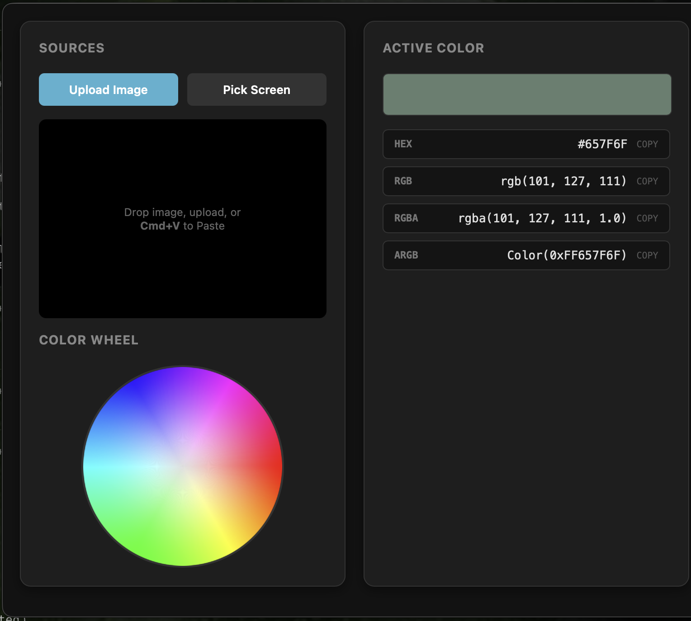

# Color Grabber for macOS 🎨

A lightweight, native macOS menu bar application to extract colors from images, your clipboard, or directly from your screen. Built with Python and `pywebview`.



## ✨ Features

- **Native Menu Bar Integration:** Lives quietly in your macOS menu bar for quick access.
- **Multiple Sources:** Upload images, paste screenshots directly from your clipboard (`Cmd+V`), or use the native Screen Picker.
- **Precision Magnifier:** A hover magnifier with a crosshair allows you to target the exact pixel you need.
- **Interactive Color Wheel:** Dynamically select shades, tints, and primary hues.
- **One-Click Copy:** Instantly copy colors to your clipboard in `HEX`, `RGB`, `RGBA`, or Flutter-ready `ARGB` formats.

## 🚀 Getting Started

### Prerequisites

- macOS
- Python 3.14+
- [uv](https://github.com/astral-sh/uv)

### Local Development

1. Clone the repository:
```bash
git clone git@github.com:IsraTech-Software/MacOS-Color-Picker.git
cd color-grabber
```
2. Install dependencies:
```bash
uv sync
```
3. Run the app
```bash
uv run python color_grabber.py
```

Look for the 🎨 icon in your top menu bar!

## 🛠 Building for Production

This project includes a GitHub Actions CI/CD pipeline that automatically compiles a bundled macOS `.app` using PyInstaller on every push to `main` or `develop`. You can download the compiled `.zip` from the GitHub Actions Artifacts tab.

To build the standalone `.app` bundle locally:

```bash
uv run pyinstaller --name "ColorGrabber" \
            --windowed \
            --noconsole \
            --add-data "standalone.html:." \
            color_grabber.py
```

The compiled macOS application will be available in the `dist/` directory.

## 📄 License

This project is licensed under the MIT License.
